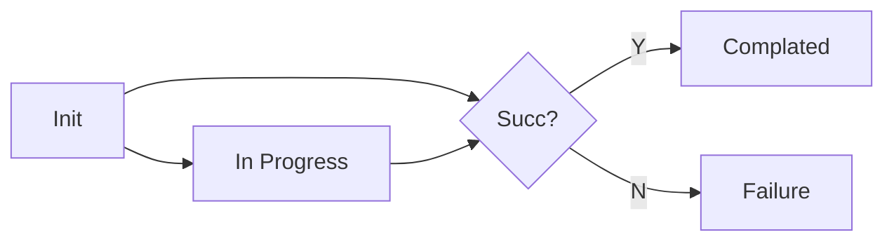

# Enhance The Status Structure Of Node Tasks
## Motivation

The current node task status consists of three elements: state, event, and action, which is too complicated. The job status and node execution status use the same type, these definitions make it look like the node task is waiting for all nodes to reach a stage before proceeding to the next stage.

In addition, there is another problem that some errors in the processing process will not be displayed to the status, especially errors in the previous process. This will result in the task not having any updates and appearing like it was not processed. The user has no way to know what happened except to look up the running logs of cloudcore and edgecore. This is not a very good user experience.

- More details refer to: [Issue #5999](https://github.com/kubeedge/kubeedge/issues/5999)
- Previous design refer to [Edge Node Tasks](edge-node-tasks-design.md)


### Goals

- Define a new state structure to make it easier for users and developers to understand.
- Track the error information of the whole process and write it to the status.


## Proposal

Separate the definitions of task status and node execution status.


### Task Status

The task state field is one of there values: Init, In Progress, Complated or Failure. Delete event and action fields, and keep the others basically unchanged.



- When an error occurs during the initialization process, the state is set to failure directly, and write the error message to the reason field.
- When a node starts executing a task, the task state is set to in progress. 
- When the specified proportion of nodes fails, the task is interrupted and the state is set to failure.
- When all node executions are executed successfully or less than the specified proportion of nodes fails, the task state is set to complated. 

When each node reports the execution results, the task state is calculated and updated.


### Node Execution Status

The node execution status consists of action and state. The action is used to indicates the stage of node execution, the state is used to indicates the result of each stage. Delete event field, and keep the others basically unchanged.

The node execution state field is one of there values: In Progress, Successful or Failure. When the status is failure, the error message will be written to the reason field.

- The NodeUpgradeJob action flow is:
    ```mermaid
    graph LR
    A[Init] --> B[Check]
    B --> C{Need confirmation?}
    C --> |Y| D[Confirm]
    C --> |N| E[Backup]
    D --> E
    E --> F[Upgrade]
    F -- Failure --> G[Rollback]
    ```

- The ImagePrePullJob action flow is:
    ```mermaid
    graph LR
    A[Init] --> B[Check]
    B --> C[Pull]
    ```
    Each node also has one or more image download tasks, which can reuse the node execution state.


## Design Details
### Structure Definition

This enhancement will upgrade the CR version to v1alpha2, and the status **will not be backward compatible**. Two versions (v1alpha1 and v1alpha2) will be defined in CRD, and storing v1alpah2.

The go file names are redefined as:
```text
v1alpha2
├── types_common.go
├── types_imageprepull.go
└── types_nodeupgrade.go
```
#### types_common.go

Defines the common structures for node tasks.

```golang
type JobState string

const (
	JobStateInit       JobState = "Init"
	JobStateInProgress JobState = "InProgress"
	JobStateComplated  JobState = "Complated"
	JobStateFailure    JobState = "Failure"
)

type NodeExecutionState string

const (
	NodeExecutionStateInProgress NodeExecutionState = "InProgress"
	NodeExecutionStateSuccessful NodeExecutionState = "Successful"
	NodeExecutionStateFailure    NodeExecutionState = "Failure"
)

// BasicNodeTaskStatus defines basic fields of node execution status.
// +kubebuilder:validation:Type=object
type BasicNodeTaskStatus struct {
	// NodeName is the name of edge node.
	NodeName string `json:"nodeName,omitempty"`
	// Action represents for the action of the ImagePrePullJob.
	Action NodeUpgradeJobAction `json:"action,omitempty"`
	// Reason represents for the reason of the ImagePrePullJob.
	// +optional
	Reason string `json:"reason,omitempty"`
	// Time represents for the running time of the ImagePrePullJob.
	Time string `json:"time,omitempty"`
}
```


#### types_imageprepull.go

Defines the dedicated structures of ImagePrePullJob.

```golang
type ImagePrePullJobAction string

const (
	ImagePrePullJobActionInit  ImagePrePullJobAction = "Init"
	ImagePrePullJobActionCheck ImagePrePullJobAction = "Check"
	ImagePrePullJobActionPull  ImagePrePullJobAction = "Pull"
)

// ImagePrePullJobStatus stores the status of ImagePrePullJob.
// contains images prepull status on multiple edge nodes.
// +kubebuilder:validation:Type=object
type ImagePrePullJobStatus struct {
	// State represents for the state phase of the ImagePrePullJob.
	State JobState `json:"state,omitempty"`

	// Reason represents for the reason of the ImagePrePullJob.
	// +optional
	Reason string `json:"reason,omitempty"`

	// Time represents for the running time of the ImagePrePullJob.
	Time string `json:"time,omitempty"`

	// NodeStatus contains image prepull status for each edge node.
	NodeStatus []ImagePrePullNodeTaskStatus `json:"nodeStatus,omitempty"`
}

// ImagePrePullNodeTaskStatus stores image prepull status for each edge node.
// +kubebuilder:validation:Type=object
type ImagePrePullNodeTaskStatus struct {
	// Action represents for the action phase of the ImagePrePullJob
	Action ImagePrePullJobAction `json:"state,omitempty"`

	// ImageStatus represents the prepull status for each image
	ImageStatus []ImageStatus `json:"imageStatus,omitempty"`

	BasicNodeTaskStatus `json:",inline"`
}

// ImageStatus stores the prepull status for each image.
// +kubebuilder:validation:Type=object
type ImageStatus struct {
	// Image is the name of the image
	Image string `json:"image,omitempty"`

	// State represents for the state phase of this image pull on the edge node.
	State NodeExecutionState `json:"state,omitempty"`

	// Reason represents the fail reason if image pull failed
	// +optional
	Reason string `json:"reason,omitempty"`
}
```


#### types_nodeupgrade.go

Defines the dedicated structures of NodeUpgradeJob.

```golang
type NodeUpgradeJobAction string

const (
	NodeUpgradeJobActionInit     NodeUpgradeJobAction = "Init"
	NodeUpgradeJobActionCheck    NodeUpgradeJobAction = "Check"
	NodeUpgradeJobActionConfirm  NodeUpgradeJobAction = "Confirm"
	NodeUpgradeJobActionBackUp   NodeUpgradeJobAction = "BackUp"
	NodeUpgradeJobActionUpgrade  NodeUpgradeJobAction = "Upgrade"
	NodeUpgradeJobActionRollBack NodeUpgradeJobAction = "RollBack"
)

// NodeUpgradeJobStatus stores the status of NodeUpgradeJob.
// contains multiple edge nodes upgrade status.
// +kubebuilder:validation:Type=object
type NodeUpgradeJobStatus struct {
	// State represents for the state phase of the NodeUpgradeJob.
	State JobState `json:"state,omitempty"`

	// CurrentVersion represents for the current status of the EdgeCore.
	CurrentVersion string `json:"currentVersion,omitempty"`

	// HistoricVersion represents for the historic status of the EdgeCore.
	HistoricVersion string `json:"historicVersion,omitempty"`

	// Reason represents for the reason of the ImagePrePullJob.
	// +optional
	Reason string `json:"reason,omitempty"`

	// Time represents for the running time of the ImagePrePullJob.
	Time string `json:"time,omitempty"`

	// NodeStatus contains upgrade Status for each edge node.
	NodeStatus []NodeUpgradeJobNodeTaskStatus `json:"nodeStatus,omitempty"`
}

// NodeUpgradeJobNodeTaskStatus stores the status of Upgrade for each edge node.
// +kubebuilder:validation:Type=object
type NodeUpgradeJobNodeTaskStatus struct {
	// Action represents for the action phase of the NodeUpgradeJob
	Action NodeUpgradeJobAction `json:"state,omitempty"`

	BasicNodeTaskStatus `json:",inline"`
}
```

### Status linkage

TODO: ...


### Record Errors

TODO: ...
